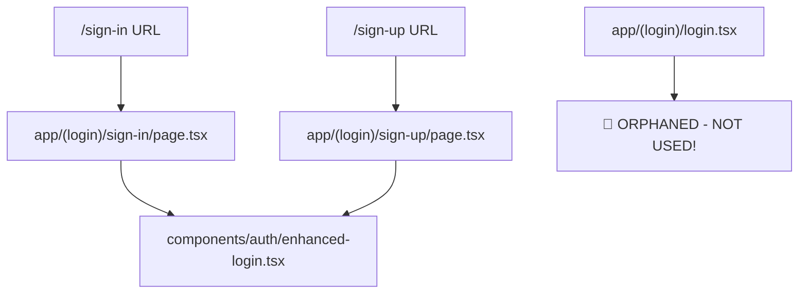
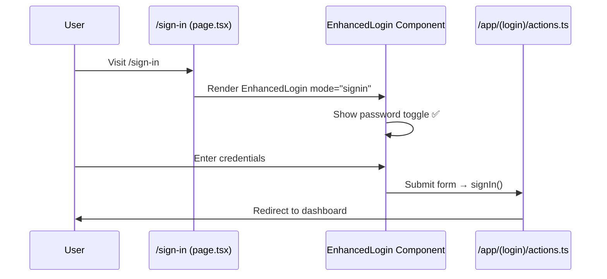

# CORRECTED Site Architecture Mapping

## 🚨 CRITICAL DISCOVERIES FROM PASSWORD TOGGLE FAILURE

### Authentication Architecture Reality Check

#### ❌ **WRONG ASSUMPTIONS (Previous Documentation)**
- Assumed `/sign-in` uses `app/(login)/login.tsx`  
- Focused debugging on wrong component for 100+ credits
- Outdated component mapping in logic diagrams

#### ✅ **ACTUAL ARCHITECTURE (Corrected)**



## Component Usage Mapping

### ✅ **ACTIVE AUTHENTICATION COMPONENTS**

| Route | File | Component | Status |
|-------|------|-----------|---------|
| `/sign-in` | `app/(login)/sign-in/page.tsx` | `EnhancedLogin` | ✅ ACTIVE |
| `/sign-up` | `app/(login)/sign-up/page.tsx` | `EnhancedLogin` | ✅ ACTIVE |
| `/forgot-password` | `app/forgot-password/page.tsx` | `ForgotPasswordForm` | ✅ ACTIVE |
| `/reset-password` | `app/reset-password/page.tsx` | `ResetPasswordForm` | ✅ ACTIVE |

### ❌ **ORPHANED/UNUSED COMPONENTS**

| File | Component | Issue |
|------|-----------|-------|
| `app/(login)/login.tsx` | `Login` | 🚨 **NOT IMPORTED ANYWHERE** |
| `components/auth/clean-registration-form.tsx` | `CleanRegistrationForm` | Unknown usage |
| `components/auth/minimal-registration.tsx` | `MinimalRegistration` | Unknown usage |
| `components/auth/validated-registration-form.tsx` | `ValidatedRegistrationForm` | Unknown usage |

## BugX Phase 0 Reality Check Framework

### Mandatory Pre-Debug Checklist

```typescript
interface ArchitectureRealityCheck {
  1. COMPONENT_USAGE_VERIFICATION: {
    question: "Which component is actually being rendered by this route?";
    method: "Check page.tsx imports and component hierarchy";
    critical: "NEVER assume component usage - always verify imports";
  };
  
  2. ROUTE_MAPPING_AUDIT: {
    question: "Does the URL path match the expected component?";
    method: "Trace from URL -> page.tsx -> component import -> actual component";
    critical: "Multiple auth components can cause confusion";
  };
  
  3. FILE_ORPHAN_DETECTION: {
    question: "Is this component file actually imported anywhere?";
    method: "Search codebase for import statements";
    critical: "Orphaned files waste debugging time";
  };
}
```

## Corrected Authentication Flow

### 1. Sign-In Process ✅ CORRECTED



### 2. Component Dependencies ✅ CORRECTED

```
EnhancedLogin (components/auth/enhanced-login.tsx)
├── Imports: Eye, EyeOff from lucide-react ✅
├── State: showPassword useState ✅  
├── Actions: signIn, signUp from app/(login)/actions.ts ✅
└── UI: Card, Input, Button from components/ui/ ✅

🚨 ORPHANED: Login (app/(login)/login.tsx)
├── Contains: Similar functionality but UNUSED
├── Problem: Misleading for debugging
└── Action: Consider removal or document purpose
```

## Updated Critical State Dependencies

### 1. Session Management ⚠️ STILL BROKEN
- **Issue**: Authentication session deletion causing rapid API polling
- **Status**: Root cause unresolved
- **Next**: Focus on `/api/user` endpoint and session cookie handling

### 2. User Menu State ⚠️ STILL BROKEN  
- **Issue**: Random switching between user menu and sign-in buttons
- **Status**: Not an SWR cache issue as previously thought
- **Next**: Investigate session persistence and cookie path issues

### 3. Financial Goals Modal ⚠️ STATUS UNKNOWN
- **Issue**: Shows "No financial goals yet" despite existing data
- **Status**: Needs investigation after auth issues resolved
- **Dependencies**: `useGoals()` context connection

### 4. Password Toggle ✅ RESOLVED
- **Component**: `components/auth/enhanced-login.tsx`
- **Status**: Working correctly after fixing component identification
- **Lesson**: Always verify component architecture before debugging

## Action Items for Architecture Cleanup

### Immediate (High Priority)
1. **✅ DONE**: Update BugX with Phase 0 Reality Check
2. **🔄 IN PROGRESS**: Update site-wide logic documentation 
3. **📋 TODO**: Audit all orphaned components
4. **📋 TODO**: Fix authentication session deletion issue

### Medium Priority  
1. Document or remove `app/(login)/login.tsx`
2. Audit other unused auth components
3. Create component usage matrix
4. Update debugging commands to reference correct components

### Low Priority
1. Consolidate authentication components
2. Create component deprecation strategy
3. Add automated architecture validation

## Updated Debug Commands

```bash
# ✅ CORRECTED: Check password toggle in actual component
curl -s http://localhost:3000/sign-in | grep -A5 -B5 "EnhancedLogin"

# ✅ CORRECTED: Verify component imports  
grep -r "EnhancedLogin" app/

# ✅ NEW: Check for orphaned components
find components/ -name "*.tsx" -exec grep -L "import.*from.*{}" {} \;

# ⚠️ STILL NEEDED: Authentication session debugging
grep -A3 -B3 "Session cookie exists: false" <(get_run_project_output 100 5)
```

## Lessons Learned

### 🎯 **Critical Success Factor**
**ALWAYS verify component architecture before debugging**
- 100+ credits were wasted assuming wrong component
- Phase 0 Reality Check prevents this costly mistake
- Component imports must be traced, never assumed

### 🔍 **Architecture Audit Process**
1. **Route Tracing**: URL → page.tsx → component import → actual component
2. **Import Verification**: Search codebase for actual usage
3. **Orphan Detection**: Identify unused components that mislead debugging
4. **Documentation Sync**: Keep architecture docs current with codebase

---

**STATUS**: Architecture mapping corrected. Ready to tackle remaining authentication and financial goals issues with accurate component knowledge.