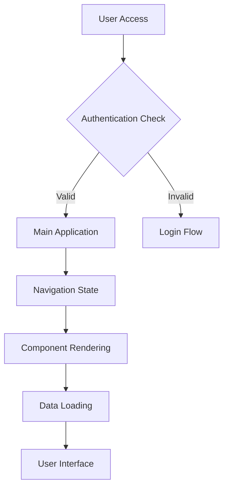

# Right Foot Framework
## Complete Project Initialization Checklist for Credit-Efficient Development

### **Phase 1: Pre-Development Setup (Day 1)**

#### 1.1 Project Documentation Structure
```
docs/
├── SITE-WIDE-CONDITIONAL-LOGIC-DIAGRAM.md     # System state flows
├── SYSTEMATIC-VALIDATION-FRAMEWORK.md         # How to test changes
├── ENHANCED-BUGX-METHODOLOGY.md              # Debug methodology
├── COMPONENT-DEPENDENCY-MAP.md               # What depends on what
├── CREDIT-SAVING-RULES.md                    # Development guidelines
├── VALIDATION-COMMAND-LIBRARY.md             # Working test commands
└── REGRESSION-PREVENTION-CHECKLIST.md       # Before/after checks
```

#### 1.2 Site-Wide Logic Diagram (Template)
Create immediately with placeholders:


#### 1.3 Validation Command Library (Starter Set)
```bash
# Authentication Flow
curl -s http://localhost:PORT/api/user | jq '.email // "NO USER"'

# Session Persistence  
curl -s -c cookies.txt -b cookies.txt http://localhost:PORT/login
curl -s -b cookies.txt http://localhost:PORT/api/user

# Component Rendering
curl -s http://localhost:PORT/page | grep -c "expected-element"

# State Management
grep -r "useState\|useContext" components/ | wc -l

# Error Detection
grep -i "error\|fail\|undefined" <(get_run_project_output 50 5)
```

### **Phase 2: Development Rules & Protocols**

#### 2.1 BugX Integration Rules
```
MANDATORY BugX Levels:
- Level 0 (30 seconds): Before every change - consult logic diagram
- Level 1 (2 minutes): After every change - basic functionality test  
- Level 2 (5 minutes): After every feature - integration test
- Level 3 (10 minutes): Before deployment - full system test

NO EXCEPTIONS: 
- Never mark task "completed" without appropriate BugX level
- Never make multiple changes without individual testing
- Never claim fixes without user-confirmable evidence
```

#### 2.2 Conditional Logic Maintenance
```
REQUIRED Updates:
- Add new components immediately to dependency map
- Update state flows when adding new features  
- Document new validation commands that work
- Note new failure modes discovered
- Record working solutions for future reference

WEEKLY Reviews:
- Verify all documented dependencies still accurate
- Update validation commands with new patterns
- Consolidate lessons learned into reusable patterns
```

#### 2.3 Credit-Efficient Development Protocol
```
BEFORE Making Changes:
1. Consult site-wide logic diagram for dependencies
2. Identify what could break
3. Plan specific validation tests
4. Estimate credit cost vs. risk

DURING Development:
1. Make smallest possible change first
2. Test immediately with planned validation
3. Update logic diagram with findings
4. Only proceed if current change works

AFTER Changes:
1. Run appropriate BugX level validation
2. Check for regressions in documented dependencies  
3. Update validation command library with working tests
4. Get user confirmation for critical fixes

BATCH vs ISOLATE Decision Matrix:
- Authentication/Session: ALWAYS ISOLATE
- Database/State: ALWAYS ISOLATE  
- UI/Styling: SAFE TO BATCH
- Content/Text: SAFE TO BATCH
```

### **Phase 3: Component Architecture Standards**

#### 3.1 State Management Hierarchy
```
1. Server State (Database)
   ├── Managed by: Server actions, API routes
   └── Validation: Database queries, session checks

2. Global Client State (Contexts)
   ├── Managed by: React Context + Providers
   └── Validation: Context connection tests

3. Local Component State
   ├── Managed by: useState, useReducer
   └── Validation: Component isolation tests

RULES:
- Never mix state levels inappropriately
- Always document state dependencies in logic diagram
- Test state flow before and after changes
```

#### 3.2 Component Dependency Standards
```
MANDATORY Documentation:
Every component must document:
- What contexts it depends on
- What API endpoints it calls
- What other components it affects
- What CSS/styling dependencies it has
- What icons/external resources it needs

DEPENDENCY MAP FORMAT:
ComponentName
├── Contexts: [context1, context2]
├── APIs: [/api/endpoint1, /api/endpoint2]  
├── Components: [child1, child2]
├── External: [library1, library2]
└── Critical: [failure modes, known issues]
```

### **Phase 4: Testing & Validation Standards**

#### 4.1 Validation Command Library Structure
```bash
# AUTHENTICATION VALIDATION
auth_check() {
  echo "Testing authentication flow..."
  curl -s http://localhost:$PORT/api/user | jq '.email // "NO USER"'
}

# STATE MANAGEMENT VALIDATION  
state_check() {
  echo "Testing state connections..."
  grep -r "useContext\|createContext" src/ | wc -l
}

# UI COMPONENT VALIDATION
ui_check() {
  echo "Testing UI rendering..."
  curl -s http://localhost:$PORT/ | grep -c "expected-ui-elements"
}

# REGRESSION VALIDATION
regression_check() {
  echo "Testing for regressions..."
  # Run all critical user flows
  auth_check && state_check && ui_check
}
```

#### 4.2 Automated BugX Integration
```javascript
// package.json scripts
{
  "scripts": {
    "dev": "next dev",
    "bugx-1": "npm run dev && ./scripts/bugx-level-1.sh",
    "bugx-2": "./scripts/bugx-level-2.sh", 
    "bugx-3": "./scripts/bugx-level-3.sh",
    "validate": "npm run bugx-2"
  }
}

// scripts/bugx-level-1.sh
#!/bin/bash
echo "🔍 BugX Level 1: Basic Functionality"
sleep 2
curl -s http://localhost:3000 > /dev/null && echo "✅ App loads" || echo "❌ App failed to load"
grep -i "error" <(timeout 5 npm run dev 2>&1) && echo "❌ Console errors found" || echo "✅ No obvious errors"
```

### **Phase 5: Credit Management Strategy**

#### 5.1 Credit Allocation Rules
```
BUDGET ALLOCATION:
- 40% Planning & Architecture (front-loaded)
- 30% Core Feature Development  
- 20% Testing & Validation
- 10% Documentation & Cleanup

NEVER EXCEED LIMITS:
- Max 50 credits per feature without user validation
- Max 20 credits investigating without clear progress
- Max 100 credits per day without major milestone

PROGRESS TRACKING:
- Measure credits per completed feature
- Track credit efficiency improvements over time
- Document what approaches save/waste credits
```

#### 5.2 Early Warning System
```
STOP WORK IF:
- 30 credits spent without visible progress
- Same issue being "fixed" multiple times
- User reporting regressions in previously "completed" features
- Test commands not working after changes

IMMEDIATE ACTIONS:
- Return to last known good state
- Consult logic diagram for missed dependencies
- Run full BugX validation
- Get user confirmation before proceeding
```

### **Phase 6: Implementation Template**

#### 6.1 New Project Initialization Script
```bash
#!/bin/bash
# right-foot-init.sh - Run this for every new project

echo "🚀 Initializing Right Foot Framework..."

# Create documentation structure
mkdir -p docs scripts
cp templates/SITE-WIDE-CONDITIONAL-LOGIC-DIAGRAM.md docs/
cp templates/SYSTEMATIC-VALIDATION-FRAMEWORK.md docs/
cp templates/ENHANCED-BUGX-METHODOLOGY.md docs/

# Create validation scripts
cp templates/bugx-level-*.sh scripts/
chmod +x scripts/*.sh

# Initialize dependency tracking
echo "# Component Dependencies" > docs/COMPONENT-DEPENDENCY-MAP.md
echo "# Validation Commands" > docs/VALIDATION-COMMAND-LIBRARY.md

# Set up git hooks for validation
cp templates/pre-commit scripts/
ln -sf ../../scripts/pre-commit .git/hooks/pre-commit

echo "✅ Right Foot Framework initialized!"
echo "📝 Next: Update docs/SITE-WIDE-CONDITIONAL-LOGIC-DIAGRAM.md with your app's flow"
```

#### 6.2 Daily Development Workflow
```
MORNING (5 minutes):
1. Review current logic diagram
2. Check validation command library
3. Plan day's changes with BugX levels
4. Set credit budget for the day

DURING WORK (Per change):
1. Consult logic diagram (Level 0 BugX)
2. Make minimal change
3. Run appropriate validation (Level 1/2 BugX)
4. Update documentation with findings
5. Only proceed if tests pass

EVENING (10 minutes):
1. Run Level 3 BugX validation
2. Update logic diagram with day's discoveries
3. Commit working validation commands
4. Review credit efficiency
5. Plan tomorrow's priorities
```

### **Phase 7: Success Metrics**

#### 7.1 Credit Efficiency Tracking
```
MEASURE WEEKLY:
- Credits per feature completed
- Number of "false fix" incidents  
- Regression incidents per week
- User satisfaction with delivered features
- Time from "fix claimed" to "user confirmed working"

TARGET IMPROVEMENTS:
- 20% reduction in credits per feature (quarter over quarter)
- Zero "false fix" incidents
- 95% user confirmation rate on first attempt
- Less than 2 hours between fix and user confirmation
```

#### 7.2 Quality Gates
```
RELEASE CRITERIA:
- All features pass Level 3 BugX validation
- Logic diagram accurately reflects system state
- All validation commands in library work
- Zero known regressions from previous releases
- User acceptance of all critical features

TECHNICAL DEBT LIMITS:
- Max 3 "TODO" items in logic diagram
- Max 5 outdated validation commands
- All components documented in dependency map
- Zero features marked "completed" without user confirmation
```

This framework essentially creates a **systematic approach** to prevent the credit waste and false fixes we've experienced, while building knowledge that compounds over time rather than starting from scratch each project.